[SkyAtlas]: https://www.dropbox.com/s/lgjoipj1q22fds5/SkyAtlasImageRepository.zip?dl=0
[Discord]: https://discordapp.com/invite/fwpmHU4
[IssuesTracker]: https://bitbucket.org/Isbeorn/nina/issues?status=new&status=open
[ASCOM]: https://ascom-standards.org/

# NINA - Nighttime Imaging ‘N’ Astronomy Manual

## Version 1.5.0.X


---

# Manual Revision History
| Version | Date | Comment |
| --- | --- | --- |
| 0.1 | 2018-04-25 | Initial draft with rough outline for preliminary version 1.4.1.0 |
| 0.2 | 2018-04-25 | Added Manual Editing Guidelines, Introduction, Requirements, Quick Start Guide |
| 0.3 | 2018-04-25 | Added detailed information for following tabs: Camera, Filter wheel+Focuser, Telescope, PHD2, Object Browser; added images to document framing assistant, sequence and settings tab; more glossary items; peer reviewed quick start guide |
| 0.4 | 2018-04-27 | Completed initial Tabs documentation |
| 0.5 | 2018-04-27 | Conversion to Markdown, minor changes |
| 0.6 | 2018-05-02 | Updated to 1.5.0.0, added screenshots and descriptions of new features |
| 0.7 | 2018-05-04 | Added more usage topics, added links to usage topics where applicable, changed version to 1.5.0.X |

# Manual Editing Guidelines
- Screenshots with NINA in 1280×720 (minimal window size) resolution to maintain readability
- Screenshots annotation with Greenshot to have the same numbering scheme
- Screenshots of UI in “Arsenic” as primary style, Dark as secondary style
- Use lots of screenshots in general, it’s easier to look at something instead of reading something, but do not skimp on text either
- Use ASCOM Simulators for Screenshots when possible
- Use the latest version of NINA, possibly the nightly builds if available (ask Isbeorn or darkarchon or build it yourself)
- Only add paragraphs to functionalities you used yourself to prevent guesswork
- Maintain an easy reading style so people who are completely new to the topic won’t get lost
- Viewers can only comment on entries, if you feel something is wrong comment on that specific section and it will be reviewed
- If you want to contribute actively notify darkarchon on Discord

---

# Glossary
| Term | Description |
| --- | --- |
| Bahtinov | A specific mask to align the focus |
| Guiding | A way to use a second camera to guide along stars to prevent the mount from having errors |
| Plate Solving | Using software and a captured image to determine where your scope is pointing at in the sky |
| Dithering | Moving the guiding output by a few pixels to shift the image by a tiny bit to prevent fixed noise patterns and missing data by hot pixels |
| HFR | Half-Flux Radius of stars in pixels which determines how focussed the average star is |
| ADU | Analogue Digital Unit, the lightness value of pixels (max. 2^BitDepth) |
| ASCOM | AStronomy Common Object Model, a standard protocol for astronomy related device drivers |
| DSO | Deep Space Object, anything that does not count as a star or planet |
| DSLR | Digital Single Lens Reflex Camera, typical hand held camera with interchangeable lenses and a mirror for the viewfinder |
| J2000/JNOW | Different epochs based on the current time or the year 2000. Used for mount location synchronization |
| OSC | One Shot Color, typical DSLR or color astro camera |
| LRGB | Lightness, Red, Green, Blue - a typical color combination for color images from a monochrome camera |

---


# Introduction
Welcome to NINA - Nighttime Imaging ‘N’ Astronomy. If you have found this document you have likely already downloaded the software - congratulations for that step!

>NINA is a software designed for all DSO imagers. If you are totally new to the world of DSO imaging or a seasoned veteran our goal is to make your image acquisition easier, faster and more comfortable.

NINA supports a wide range of cameras, mounts and accessories. This is achieved by utilizing the powerful ASCOM platform. The software allows you to connect all of your devices in one place and interconnects them in ways to make your imaging workflow as simple as possible, while still maintaining a high degree of customization.

From control of mounts, cameras, focusers and filter wheels to detailed information about your current image with detection of HFR of your stars, useful statistics to determine your exposure time, auto stretching your image results over support for polar alignment, focus, framing, plate solving and target selection as well as generating powerful reusable sequences - this software has it all.

This document is aimed to describe the functionality of NINA so you can utilize it to its fullest potential. It is divided into three rough chapters: [Quick Start Guide](#quick-start-guide) to get you started, [Tabs](#tabs) for full functionality, and [Advanced topics](#usage) which should cover everything you need to know to effectively run the software. Should you have questions, issues, want to help development or just want to chit chat with us feel free to join the [Official NINA Discord][Discord] or record your findings in the [official Issues Tracker][IssuesTracker].

> Important notes will appear like this throughout the documentation, if you happen to find a note like this don't skimp over it!

> Please note that images in this manual might not 100% reflect what you see, they will only be updated for a specific section if there actually were some updates in this version.

---

# Prerequisites, Compatibility and System Requirements

## NINA Download
- [Download Latest Version](https://bitbucket.org/Isbeorn/nina/downloads/)

## Minimum System Requirements
- 64bit Windows 7 or later
    - 32bit builds are available, but might be unstable and less tested
- [.NET Framework 4.6.2 or later](https://www.microsoft.com/en-us/download/details.aspx?id=48130)
- [ASCOM Platform 6.3 or later][ASCOM]
- [Visual C++ Redistributable Runtime 2013](https://www.microsoft.com/en-us/download/details.aspx?id=40784)
- At least 2GB RAM
- A dual core CPU (technically should run on single core too)
- 70MB of free disk space without SkyAtlas

## Supported Devices
- Cameras
    - [ASCOM][ASCOM] supported 64bit camera driver
    - ZWO cameras with native driver
    - Atik cameras with native driver
    - Canon cameras
    - Nikon cameras
        - Some Nikons may require a serial shutter cable for bulb exposures
- Mounts
    - All [ASCOM][ASCOM] compatible mounts
- Filter Wheels
    - All [ASCOM][ASCOM] compatible filter wheels
- Focusers
    - All [ASCOM][ASCOM] compatible focusers
 
> Please note that for the 64bit version of NINA you need 64bit drivers for your ASCOM devices.

## Supported Software
- [PHD2](https://openphdguiding.org/)
- [Local Astrometry.net Plate Solver](https://adgsoftware.com/ansvr/) (bundled as Opt-In with installation of NINA)
- [PlateSolve 2](http://planewave.com/downloads/software/)
 
## Additional Downloads
- [SkyAtlas Image Repository][SkyAtlas] (0.93GB)

---


# Quick Start Guide

## Quick Start: UI Overview

Once you start NINA for the first time you will be greeted with this screen. Let’s go over the basics for a moment to accustom you with the usage of this software.

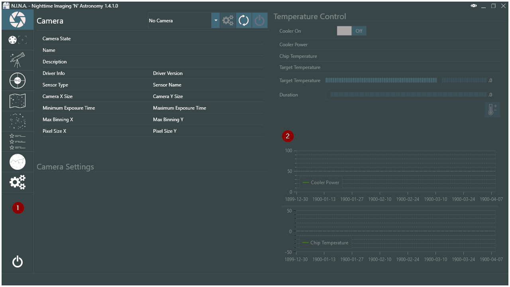

The UI is divided in 2 panes. On the left side tabs section (1) you will find all the necessary tabs to connect your equipment, on the right side you usually find the detailed information about the currently selected tab. The currently selected tab is highlighted on the left side (1) so you always know where you are. Feel free to click through all of them; the detailed descriptions for all tabs are provided in the [Tabs section](#tabs). For now let’s assume you have a DSLR camera and mount with no filter wheel or any extras and just want to start a simple sequence.

> This quick start guide assumes you know how to connect your equipment to the computer and have the appropriate drivers for [ASCOM][ASCOM] and your camera (if necessary) already installed. If you do not, don’t hesitate to ask us on the [official NINA Discord server][Discord].

---

## Quick Start: Connecting Your Equipment

Now let us focus on connecting your camera and mount for the first time. 

> You should have physically connected your camera and mount to the PC NINA is running on already. If you did not, connect it now. 

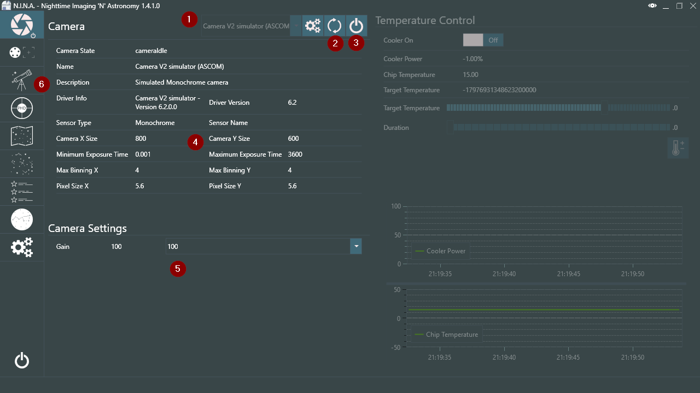

Now you need to select your camera in the drop down menu (1). If it does not appear in the list press the refresh button (2). If you are using a Nikon camera you need to select the general “Nikon” option from the drop down menu. Once you selected your camera press the Connect button (3) to connect the device.

Once your device is connected it will display various information about the camera (if available) in the Camera section (4). 

> Keep in mind that if you are using a DSLR the information might be incomplete or missing. That doesn’t deter NINA from working, but should you need to find the information you have to look for it online.

When you connect a camera that has the ability to change the gain (ISO) it will be displayed in the Camera Settings section (5). This is the default gain that will be used and can be overridden by settings during imaging later.

Once you connected your camera you will need to connect your mount. For that we have to switch to the telescope tab (6).

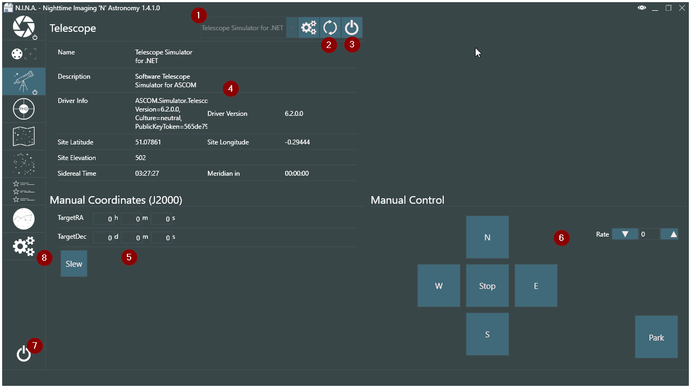


Here we have the same procedure to connect the mount as we have with the camera. Select the mount from the dropdown (1), refresh if not available (2), and press connect (3) to connect to the mount.

In the Telescope section (4) you will find useful information about the latitude, longitude, elevation, sidereal time and when it will arrive at the meridian as saved in the driver/mount or calculated by NINA. You can manually slew to specific coordinates with (5) or control the mount manually in the Manual Control section (6).
> This is very useful if you don’t use a hand controller anymore.

## Quick Start: Finalizing the settings

> This whole setup routine only has to be done once for a specific profile. Once you have your default mount and camera set you just need to press the Connect button (7) once NINA is started up to connect to the saved equipment automatically.

We have a few small steps to do before we can start with imaging. For that we need to switch to the Settings tab (8).

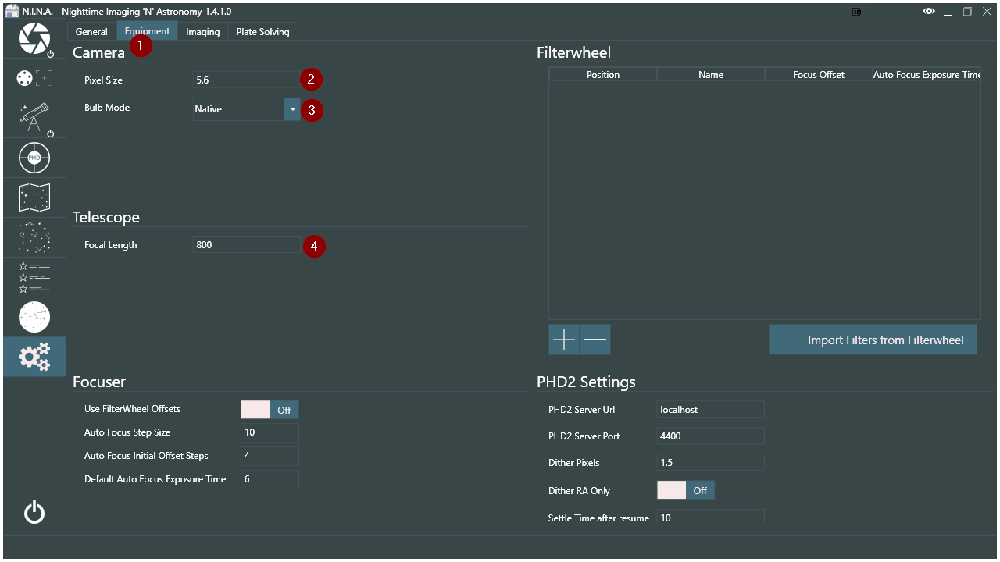

In the settings we go directly to the Equipment tab (1) and have to set a few things first. You should set your pixel size to the pixel size that your camera has, if it has not been set automatically, which is the case with most DSLR. Search online for the pixel size of your camera and enter the value in (2). 

> If you have an older Nikon camera you might not be able to use the native bulb mode for long exposures (>30s) via USB. If you have a RS232-Shutter cable or your mount has a shutter port which is connected to the camera change the setting in (3). Please refer to the Advanced topic [using RS232 or mount for bulb shutter](#using-rs232-or-mount-for-bulb-shutter).

Finally, you will need to set your Telescope or lens focal length in (4).

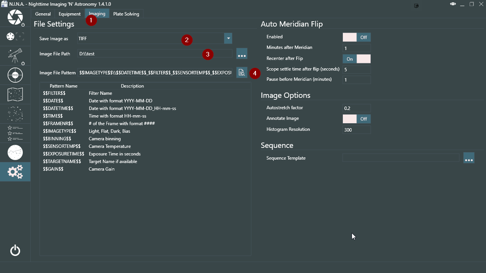

Now we have to set a few other image saving related settings as well. To do that switch to the Imaging tab (1). The images can be saved as TIFF (with two different compression algorithms, too), XISF and FITS (2). TIFF is a solid format and this setting can be left unchanged. If you want to save space use a compressed TIFF format. Feel free to change it though should you prefer a different format. Next you need to set the Image File path (3). This is the place where your images will be saved. And finally, if you want you can change the Image File Pattern (4). This is how the images will be named after. You can see variables that you can use below the panel and with the button next to (4) you can check how your file pattern will look like. You can leave this setting on default or customize it as you like.

Once you have done that we can move on to to focusing and starting a sequence.

## Quick Start: Focusing

To start imaging you first want to focus. For that, let’s switch to the Imaging tab (1).


Once there, you will be greeted with this view. There is a lot of information and panels around, but in general it’s divided in two spaces. First, where you can view and interact with the panels (2) and a second where you can enable and disable various panels (3). Since we only use a DSLR and a mount let us disable disable a lot of those panels to get a better overview. Feel free to enable and disable your panels at will, in this example I will disable the following panels by clicking on their icon:

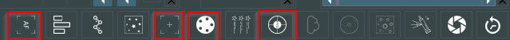

You can leave those panels enabled, or disable any other at your will. Feel free to experiment around to see what you like. You can also drag the panels around inside the imaging window and rearrange and customize your look and feel. For tutorial reasons, I will leave that be for now. 

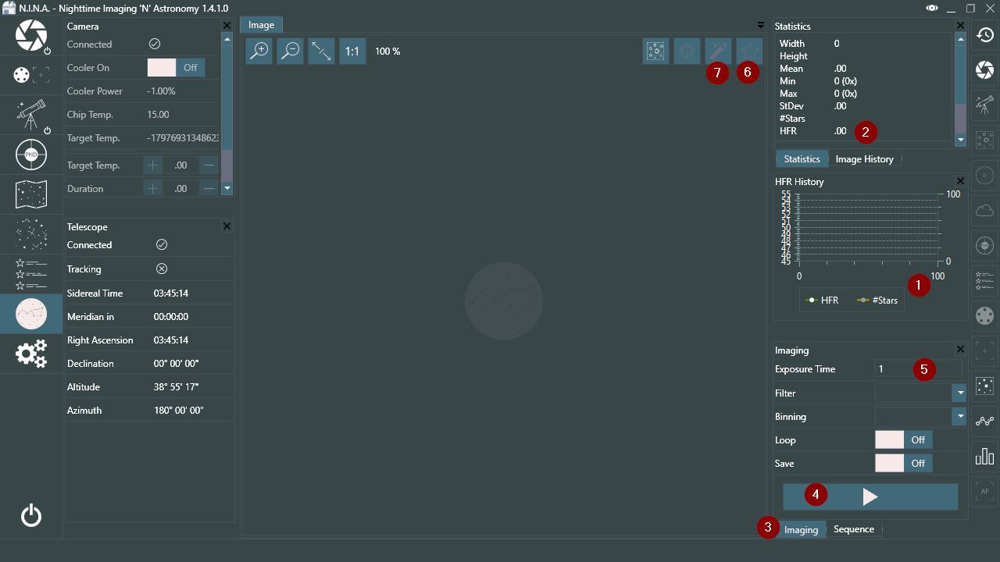

Since our target now is to focus our telescope to get pinpoint stars, we have to use the the following currently enabled panels.

> An alternative to focus is to use a Bahtinov Mask. You can try our experimental feature for Bahtinov Detection by enabling the icon in the [Image panel](#panel-image).

With the HFR History (1) you will be able to see how your stars perform in terms of HFR. This is also represented in the Statistics panel (2). The lower your HFR value, the better focused your image will be. To start the manual focus procedure, you have to select the Imaging tab (3) and press on the start capture button (4). Your exposure time for that snapshot can be adjusted as well, should you choose to do so (5).

To enable star detection and HFR analysis, you need to press on the Star Analysis button (6). This will yield a full analysis of the image and will enter the HFR values in the Statistics (2) and HFR History (1). You will notice that the AutoStretch button (7) will be enabled as well once you enable the Star Analysis button (6).

Here are two examples of a focused and defocused star field.

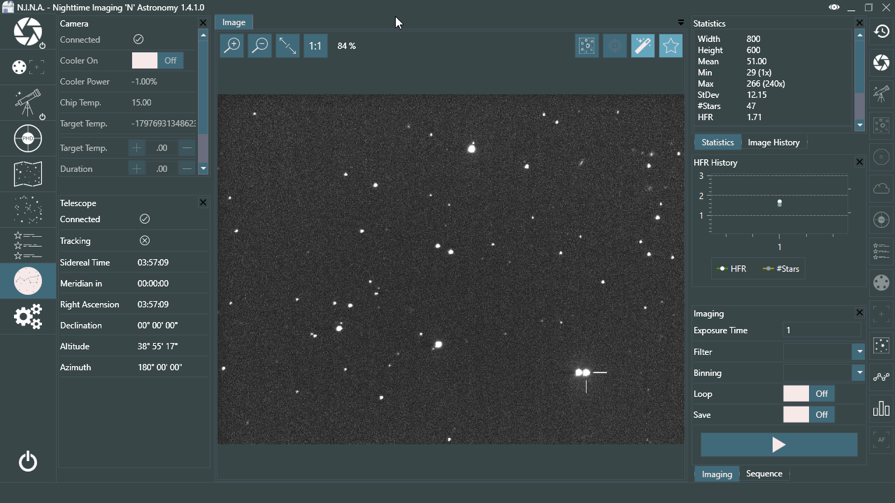


As you can see, the values for HFR have been entered in the HFR history and are displayed in the Statistics as well. The second image is definitely defocused with a HFR of 2.14, while the first image is in as good focus as possible. Your HFR values will vary because they depend on the focal length of the telescope as well as on the pixel size of the sensor, but you should try and focus your telescope until the HFR is as low as possible.

## Quick Start: Starting a Sequence

Once you nailed your focus you can switch to the Sequence tab (1).

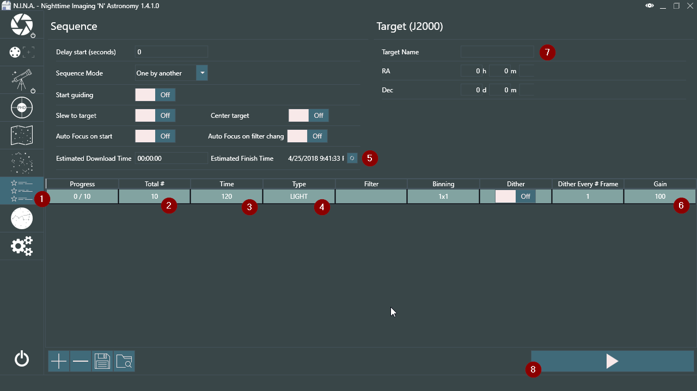

Here we can find various options. For DSLR users it’s a relatively simple matter; enter the amount of images you want to shoot in Total # (2), enter the time for a single image (3) and the type (4), which likely will be LIGHT at that point. The type is only used for the file name pattern that we set in the settings and display on the user interface in the imaging tab. You may also change your gain for the sequence in the Gain column (6).

With a press on the refresh estimated finish time button (5) you can see when the sequence is likely going to end. This value will change during the sequence depending on the average download time of your camera. Once you are satisfied with the sequence settings you can set a target name (7), which will be applied to the file name pattern as well. Finally press Start Sequence (8) to start the imaging sequence. From there on we will switch to the Imaging tab again (8).

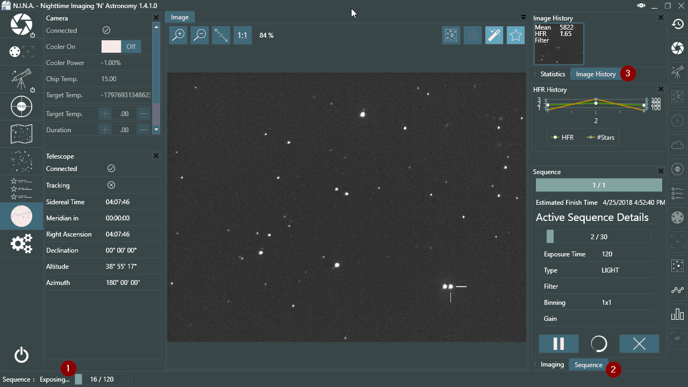

Here you will see some small changes about the status of the sequence. At the bottom left (1) you see the current status of the camera which will change depending on what it is doing. In the sequence tab (2) you will see the estimated finish time and information about the image that is getting shot currently. You can also pause or cancel the sequence prematurely using the two buttons at the bottom of the sequence tab. Finally in the Image History (3) you will see the past images you shot and you can open them from there to review them. From here on it’s waiting until your sequence completes. Good luck and clear skies!

---

# Tabs

## Tab: Camera

The Camera panel allows you to connect ASCOM based cameras as well as various ZWO cameras in native mode, Canon and Nikon cameras. The User Interface consists out of following elements:

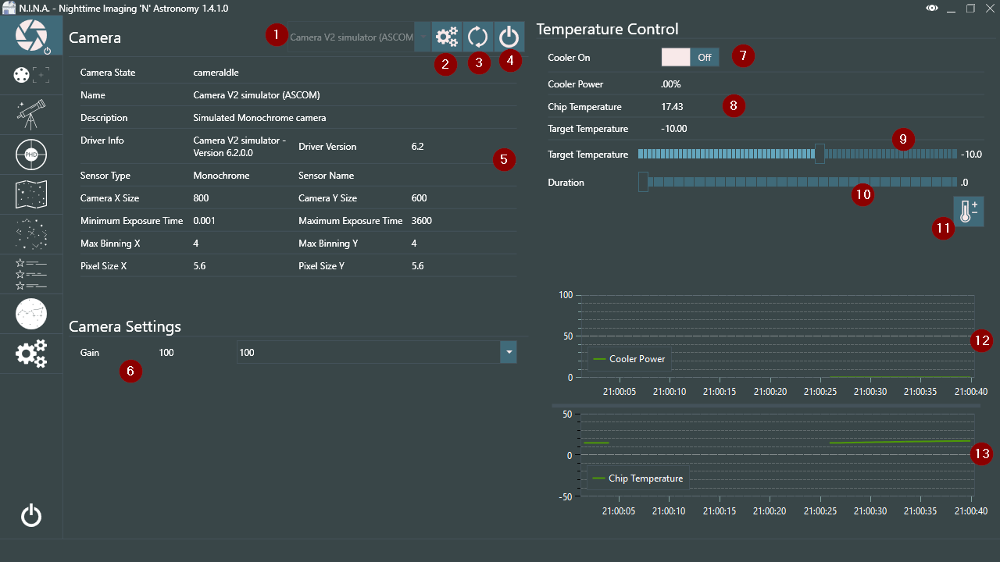

1. **Camera Drop Down**
    - Select the Camera to connect
    - Canon cameras will show up as their own devices
    - For Nikon you have to select the general “Nikon” option
2. **Camera Settings (ASCOM)**
    - Start the ASCOM settings software for the selected camera (if available)
3. **Refresh Camera Devices**
    - Refreshes the device list and checks for newly connected cameras
4. **Connect Camera**
    - Attempts to connect the camera to NINA
    - Nikon cameras can take a bit longer
        > Clearing up the SD card or using no SD card with Nikon cameras will speed up this process
5. **Camera Information**
    - Displays various information about the connected camera
        > Please note that DSLR do not report all necessary data
6. **Gain, Offset and USB Limit Settings**
    - Allows the change of Gain, Offset and USB Limit
        > Please note that the specific driver has to support this  

> Following settings need the camera to have an active cooler and report its status to NINA

7. **Cooler status and switch**
    - Enable to start cooling the camera to the selected Target Temperature (9)
8. **Temperature Information**
    - Shows the current cooler power, chip temperature and target temperature
9. **Target Temperature setting**
    - Allows you to set the target temperature that the camera will try to cool down to
10. **Duration for Cooldown**
    - Allows a gradual cool down of the camera to prevent dew from forming
    - Duration is set in minutes
11. **Start Cooling**
    - Starts the cooling to the target temperature
    - If Duration (10) is set it will try to achieve the temperature within the given duration
        > Formula used is f(x) = x^3, temperature will be reduced slower over time. Adapted cooling is not yet implemented but might be in the future.
12. **Cooler Power graph**
    - Displays the last 100 cooler power readouts in a graph
    - Might be missing values when the camera is downloading
13. **Chip Temperature graph**
    - Displays the last 100 chip temperature readouts in a graph
    - Might be missing values when the camera is downloading

---

## Tab: Filter Wheel and Focuser

In the Filter Wheel and Focuser tab you can connect your ASCOM based filter wheels and auto focusers. It also allows you to switch filters or change settings for the auto focuser, including focus movement. The User Interface and functionality consists out of following elements:

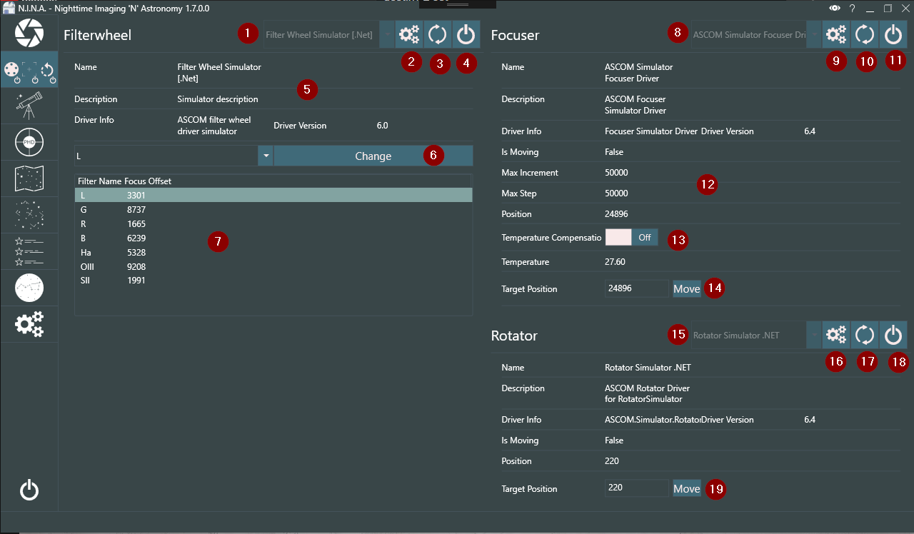

1. **Filter Wheel Drop Down**
    - Select the filter wheel to connect
2. **Filter Wheel Settings (ASCOM)**
    - Start the ASCOM settings software for the selected filter wheel (if available)
3. **Refresh Filter Wheel Devices**
    - Refreshes the device list and checks for newly connected filter wheels
4. **Connect Filter Wheel**
    - Attempts to connect the filter wheel to NINA
5. **Filter Wheel Information**
    - Display of a few information about the filter wheel
6. **Filter Wheel Filters**
    - List of all Filters with Focus Offsets as provided by ASCOM
    - A click on a specific filter will move the filter wheel to that position
        > The ASCOM filter list needs to be imported once to the NINA settings, refer to [Equipment Settings](#equipment-settings)
7. **Focuser Drop Down**
    - Select the focuser to connect
8. **Focuser Settings (ASCOM)**
    - Starts the ASCOM settings software for the selected focuser (if available)
9. **Refresh Focusers**
    - Refreshes the device list and checks for newly connected focusers
10. **Connect Focuser**
    - Attempts to connect the focuser to NINA
11. **Focuser Information**
    - Display of various information about the focuser and its status
12. **Focuser Temperature Compensation**
    - Enables compensation for ambient temperature of the focuser if a temperature sensor is available to compensate for focus drift due to temperature change in the night
    - Disables manual movement of the focuser
13. **Focuser Target Position and Move**
    - Allows you to set a specific focuser target position
    - Is disabled when automatic temperature compensation is enabled

---

## Tab: Telescope 

The Telescope tab allows you to connect your ASCOM supported mount, slew it to set coordinates and fully control it manually in every direction, including parking. The User Interface and functionality consists out of following elements:

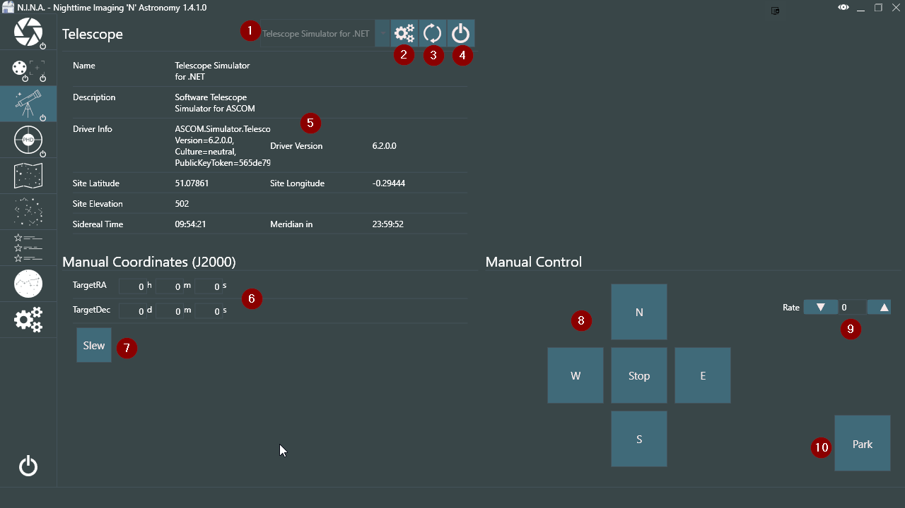

1. **Telescope Drop Down**
    - Select the mount to connect
2. **Telescope Settings (ASCOM)**
    - Starts the ASCOM settings software for the selected mount (if available)
3. **Refresh Telescope Devices**
    - Refreshes the device list and checks for newly connected mounts
4. **Connect Telescope**
    - Attempts to connect the mount to NINA
5. **Telescope Information**
    - Display of various information about the mount, including most notably Sidereal time and time to meridian
6. **Manual Coordinates**
    - Allows input of manual coordinates for right ascension and declination in arc-hours, -minutes and -seconds
        > Please note the coordinates are in the J2000 epoch
7. **Slew**
    - Slews the mount to the entered coordinates
8. **Manual Controls**
    - Allows you to slew the mount manually north, east, south and west
9. **Manual Slew Rate**
    - Allows you to set the mounts slewing rate for manual slewing
10. **Park**
    - Parks the mount to its home position
    - Unparks the mount when parked

---

## Tab: PHD2

With the PHD2 tab you can connect NINA to PHD2 to send dither commands and receive current guiding information in the User Interface. 

> For further information about PHD2 and dithering refer to [Usage: Dithering with PHD2](#dithering-with-phd2)

It consists out of following elements:


1. **Connect PHD2**
    - Attempts to connect PHD2 to NINA
        > You need to enable the server in PHD2 and possibly adjust the PHD2 settings in the [Equipment Settings](#equipment-settings)
2. **PHD2 Information**
    - Displays information about the connection status, pixel scale in PHD2 and the current state of the guider
3. **Y-Axis Scale**
    - Allows you to change the scale of the Y-Axis, is affected by (4)
4. **X-Axis Scale**
    - Allows you to change the scale of the X-Axis
        > Can also be set in the [Equipment Settings](#equipment-settings)
5. **Y-Axis Scale units**
    - Allows you to change the scale of the Y axis between arcseconds (recommended) and pixels. PHD2 natively displays information in arcseconds
6. **RMS Display**
    - Displays the current Root Mean Square error in RA, Dec and Total
7. **Guiding graph**
    - Displays the guiding graph as received by PHD2. Colors are identical for RA and Dec as they typically are in PHD2.

---

## Tab: Object Browser

In the Object Browser you can search for various objects in the sky, filter by object type and other various criteria, set them as sequence target or for the framing assistant. 

> For further information about the object browser refer to [Usage: Using the Object Browser](#using-the-object-browser)


The UI consists out of following elements:

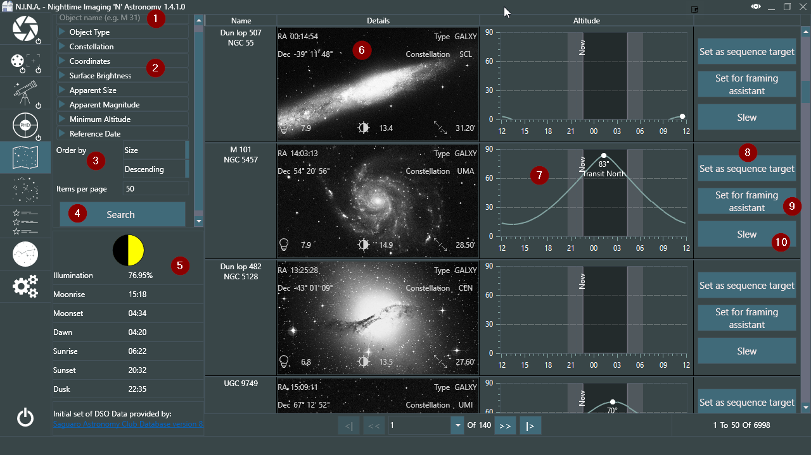

1. **Search Field**
    - Here you can search for the object designation
    > Commonly used names (e.g. “Andromeda”) are not implemented at the moment
    - Can be left empty
    > You can press "Enter" to search
2. **Filters**
    - Here you can filter your search by various object criteria
        - Object type
            - Galaxy, 2 Stars, 1 Star, Cluster with Nebulosity in a Galaxy, Open Cluster, Planetary Nebula, Galaxy cluster, 3 Stars, Globular Cluster, Asterism, Dark Nebula, Bright Nebula, 8 Stars, Nonexistent, Supernova Remnant, Cluster with Nebulosity, Quasar, 4 Stars, Diffuse Nebula in a Galaxy, various forms of clusters in the LMC and SMC
        - Constellation: you can select any constellation in the night sky
        - Coordinates: here you can limit your search to specific right ascension and declination coordinates or a specific subset of those
        - Surface brightness: you can limit your search to objects with specific surface brightness if specified
        - Apparent size: here you can limit your search to objects with a specific apparent size or a range of it
        - Apparent magnitude: here you can limit your search to objects with a specific apparent magnitude or a range of it
        - Minimum altitude: here you can limit your search with objects that are at a minimum specified altitude during a specific timeframe
        - Reference date: here you can set the reference date should you plan a sequence for the future
3. **Order settings**
    - Here you can order the objects by various criteria
        - Size, Apparent Magnitude, Constellation, RA, Dec, Surface Brightness and Object Type
    - You can also change the order from Descending to Ascending
    - You can limit the items per page to a specified number
        > Be aware that high numbers can possibly lead to performance issues
4. **Search**
    - Start the search for objects based on the set parameters
5. **Moon phase**
    - Displays the moon phase according to the coordinates of Lat/Long as set in the [Settings](#general-settings)
6. **Object information**
    - Displays various object information, including name, RA, Dec, Type, Constellation, Apparent magnitude, surface brightness and size. If the [SkyAtlas][SkyAtlas] is installed, it also displays an image from the SkyAtlas.
7. **Object altitude**
    - Shows the objects altitude, what direction it will transit and the darkness phase of the specified day, including the current time
    > Altitude depends on Latitude and Longitude set in the [Settings](#general-settings)
8. **Set as Sequence**
    - Sets the object as sequence target and uses its name in the [sequence tab](#tab-sequence) as well
9. **Set for Framing Assistant**
    - Sets the object as target for the [framing assistant](#tab-framing-assistant)
10. **Slew**
    - Slews the mount to the specified object

---

## Tab: Framing Assistant

The Framing Assistant allows you to frame your next shot perfectly utilizing DSS data or images from the previous night. It can utilize plate solving to perfectly align your telescope to the rectangle you select.

> For further information about using the Framing Asisstant refer to [Usage: Framing with the Framing Assistant](#framing-with-the-framing-assistant)

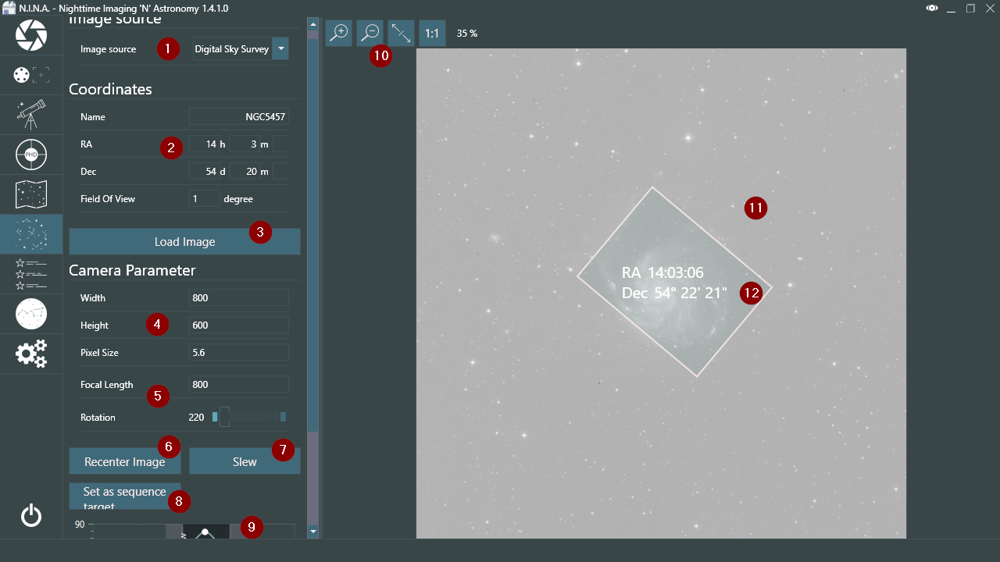

1. **Image Source Drop Down**
    - Allows you to change the image source
    - Possible options are
        - Digital Sky Survey: requires an internet connection to download the data
        - From File: can load in a jpg, gif, png or tif file
        - Cache: utilizes the local cache
            > Successfully solved local images and DSS are cached
    - From File will utilize the Blind Solver to determine the coordinates and it can take a while
2. **Coordinates**
    - You can set the name, RA and Dec coordinates here as well as the field of view in degrees
    - RA, Dec and field of view are unavailable when loading from file
        > Fields will be populated once the image has been solved
3. **Load Image**
    - Starts the image download from DSS
    - Starts the plate solving mechanism when using from file
    - Tries to load the coordinates from cache
4. **Width, Height and Pixel Size**
    - Values will be set from a connected camera automatically if available
    - Not available for DSLR users
    - Necessary for the frame size (12)
5. **Focal length and rotation**
    - Focal length is not synchronized to the Settings page
        > This allows you to play around with various focal lengths to check your framing
    - Rotation can be set freely and should match your cameras orientation as determined by plate solving
    - Necessary for the frame size (12)
6. **Recenter Image**
    - Centers the image on the current coordinates as set by the framing window (12)
7. **Slew**
    - Slews the mount exactly to the center of the framing window (12)
8. **Set as Sequence Target**
    - Sets the coordinates of the RA and Dec of the framing window as the sequence and copies the name over to the [sequence tab](#tab-sequence) as well
9. **Altitude browser**
    - Displays the current time, altitude of the target and night cycle
10. **Image display controls**
    - From left to right: Zoom in, zoom out, fit image to screen, show image in original resolution
11. **Image**
    - The image as downloaded from DSS, cache or autostretched loaded file
12. **Framing rectangle**
    - Depends on the camera (4) and telescope (5) settings
    - Can be dragged around with the mouse
    - Can be rotated with (5)
    - Displays the coordinates of the center
    - Center of the framing rectangle can be slewed to (7) or set as [sequence](#tab-sequence) target (8)

---

## Tab: Sequence

With Sequences you are able to create imaging sequences with various options for automation. The main usage is to set exposure times, filters and other settings for a total amount of frames to not have to shoot manually and have it stop after a specific amount of frames.

> For further information about sequencing refer to [Usage: Advanced Sequencing](#advanced-sequencing) and [Usage: Automated Meridian Flip](#automated-meridian-flip).

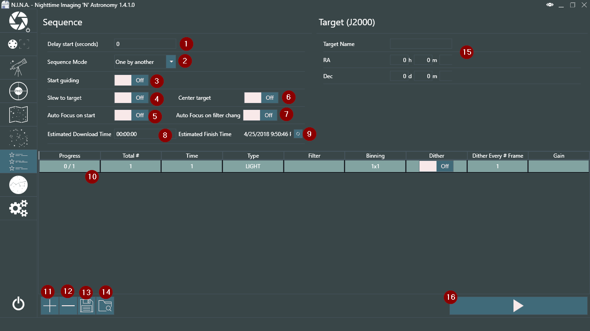

1. **Delay start**
    - Allows you to delay the start of the sequence by a specific amount of seconds
2. **Sequence Mode**
    - You can change the sequence mode from “One by another” to “Rotate through”
        - “One by another” would process each sequence entry (10) fully before switching to the next sequence entry
        - “Rotate through” would process one item from a sequence entry and then continue with the next. Allows for example the rotation of LRGB sequences.
3. **Start guiding**
    - When enabled will try to start guiding with PHD2 after the start of the sequence
    - PHD2 needs to be connected in the [PHD2 Tab](#tab-phd2)
4. **Slew to target**
    - Slews to the target as specified in RA and Dec
    - Does not Plate Solve to verify it is on target
5. **Auto focus on start**
    - Starts the auto focuser sequence to pinpoint the automatic focus
    > Requires a connected auto focuser
6. **Center target**
    - Will center the target given the Ra and Dec coordinates
    - Utilizes the plate solver as specified in the settings
    > Requires a set up [primary plate solver](#plate-solving-settings)
7. **Auto focus on filter change**
    - Starts the auto focus routine for every switch of the filter wheel
    > Requires a connected [auto focuser](#tab-filter-wheel-and-focuser)
8. **Estimated Download Time**
    - You can enter the approximate download time your camera takes to download a single image
    > Will be automatically populated with the average download times as measured by NINA on image download  
    > Will be added to calculations of (9)
9. **Estimated Finish Time**
    - Shows you the estimated finish time when your sequence will end
    - Adds the download time (8) to each sequence entry
    > Needs to be manually refreshed using the button on the right of the estimation
10. **Sequence entry**
    - Each sequence entry consists out of up to 9 columns which determine how the image will be shot
        - Progress: shows the current progress of the image sequence
        - Total #: the amount of frames for that specific sequence entry
        - Time: the exposure time in seconds
        - Type: the type of the sequence entry: BIAS, DARK, LIGHT, FLAT. Takes into effect only on the naming of the file pattern
        - Filter: the filter that should be used
        - Binning: the binning of your camera that should be used 
        - Dither: enable it if this sequence entry should dither while downloading
            > Dithering will only work when [PHD2](#tab-phd2) is connected
        - Dither Every # Frame: will dither only every # frame as set when dithering is enabled
        - Gain: Change the gain of the camera for this entry. Only available when camera can set gain
    - Sequences cannot be changed while the sequence is running, you need to pause, abort it or wait until it’s finished to change the amount of frames
11. **Add new Sequence entry**
    - Adds a new sequence entry line
12. **Delete Sequence entry**
    - Deletes the currently selected sequence line
13. **Save Sequence**
    - Allows you to save the sequence as a .xml file
14. **Open Sequence**
    - Allows to load a previously saved sequence file.
    - Will overwrite all current sequence settings
15. **Target information**
    - Shows you the target name, RA and Dec
    - Can be changed from here
    - RA and Dec will affect slew on start (4) and center target (6)
16. **Start Sequence**
    - Starts the sequence
    - Once started morphs into two buttons which allow you to pause or cancel the sequence
        - Pausing will pause the sequence after the current frame
        - Cancel will abort the frame capture completely and stop the sequence

---

## Tab: Imaging

The Imaging Tab is the most important tab of all. You will spend most of your time here while actually imaging, thus it is the most powerful tab of them all as well. It allows you to show the currently captured image, lots of information about it, plate solve images, show your image history and many more things, which are going to be explained during the next pages.

First a quick overview over the imaging tab.

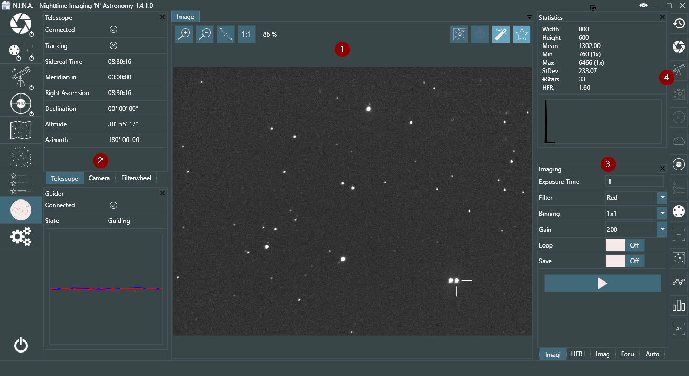

1. **The Image itself**
    - This panel cannot be disabled and will always be displayed
2. **Various panels on the left side of the image**
3. **Various panels on the right side of the image**
4. **The panel bar where you can enable and disable panels**
    - To enable or disable a panel click on the corresponding icon

---

### Panel Adjustment and Personalization

The imaging tab can be completely personalized to your wishes. You can enable and disable various panels or reposition them freely, designing the User Interface to your personal liking. The settings are stored and will be reused the next time you start NINA.

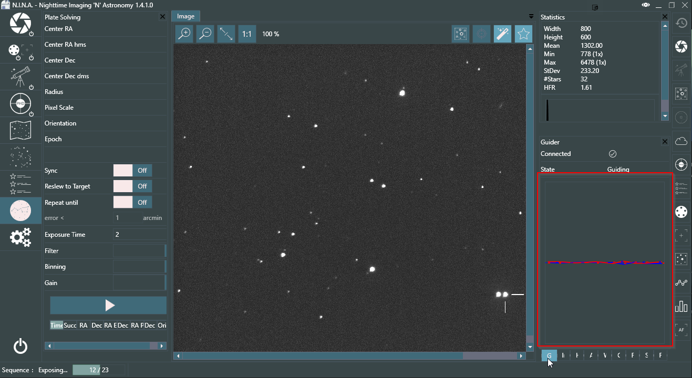

To start personalizing first you need to select the panel that you want to move. You can click and drag it either by the tab below it (see mouse cursor) or at the title bar to the left of the [x]. This action will detach the panel and give you following view:

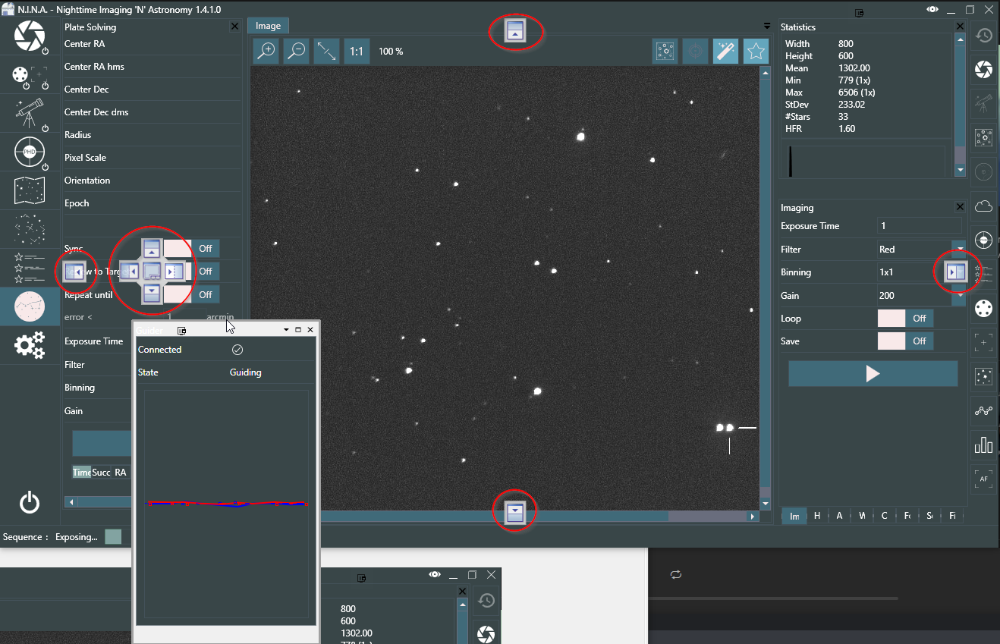

As you can see the panel is free floating now and can be attached to various points marked with the red circles. You can move any panel this way to any position. This also allows you to split panels, for example here on the left side with the Plate Solving panel: 

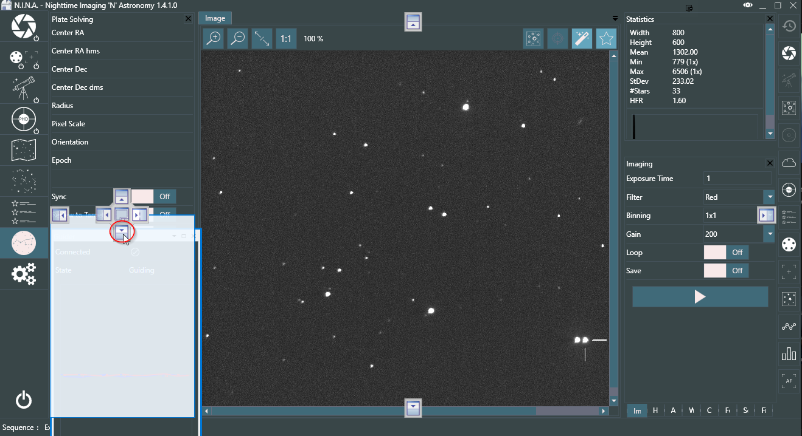

To split a panel move the new panel to the location where you want that split to be. Since I want to split the Plate Solving panel horizontally I move it to the bottom. Feel free to experiment with various splits and designs and change the imaging tab to your liking. After releasing the mouse button, you should have a layout like this:

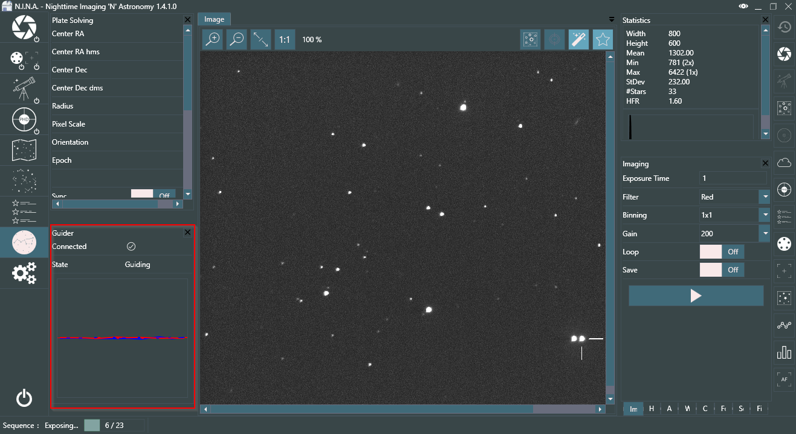

---

### Panel: Image

The image panel displays the latest captured image. You can zoom, plate solve or stretch the image from here to freely look at it.

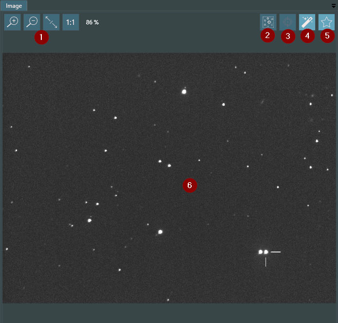

1. **Image Controls**
    - From left to right: Zoom in, Zoom out, Fit image to Screen, Show image at 100% scale
2. **Plate Solve current image**
    - This will trigger the plate solving mechanism that will attempt to plate solve the currently captured image
        > The solved result will be displayed in the [Plate Solve panel](#panel-plate-solving)  
        > For Usage of the Plate Solver refer to [Usage: Plate Solving](#plate-solving)
3. **Crosshair**
    - Displays a crosshair overlay over the image
4. **Auto Stretch**
    - Stretches the image should it be too dark to see anything
    > Auto Stretch factor can be set in [Settings](#imaging-settings)
5. **Star Detection and analysis**
    > Will also enable (4)
    - Tries to detect the stars in the image to output a [HFR result](#panel-hfr-history)
    - When annotation is enabled in the [Settings](#imaging-settings), will annotate the stars with their respective calculated HFR
6. **Bahtinov Helper** *(Experimental feature)*
    - Tries to detect the bahtinov Pattern on an image
    - Displays a rectangle which can be dragged around
        > Beta status, might not work as expected, report bugs or issues if you have any!
    - 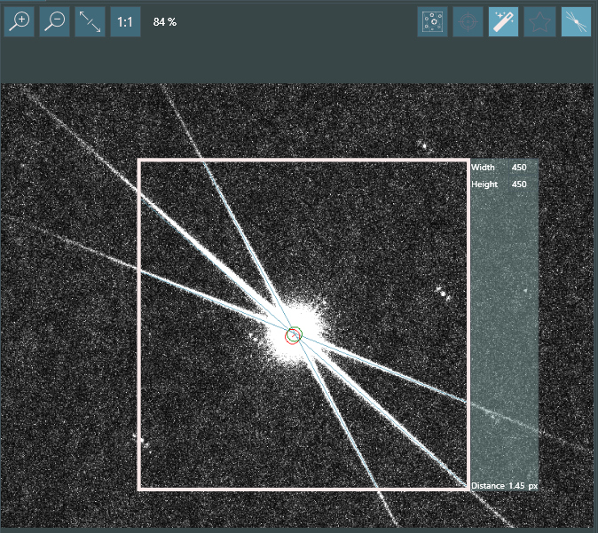
7. **Subsampling Rectangle** *(Experimental feature)*
    - If your camera allows subsampling of a frame will display a rectangle, which can be dragged around the image
    - Enabling subsampling in the [Imaging panel](#panel-imaging) will only download the displayed rectangle as long subsampling is enabled
        > Currently only implemented for native Atik cameras
    - 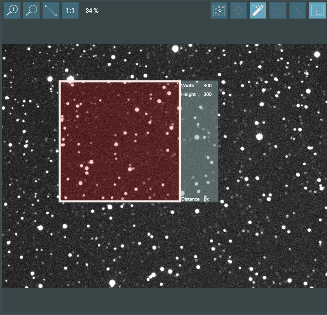
8. **Your captured image**
     - Display of the last captured frame or a loaded frame from the [Image History](#panel-image-history)
     - Is affected by (4) and will be displayed autostretched when enabled


---

### Panel: Image History

Displays the last captured images in a thumbnail with mean ADU value, HFR, selected filter, duration and time. You can open a single image in the Image panel by clicking on it.


---

### Panel: Camera

The Camera panel displays various information about the current state of the camera. It shows you the connection status, default set gain and allows you to enable cooling.


> Cooling requires a camera with an active cooler that reports to NINA  
> Requires a connected [camera](#tab-camera) to display information
1. **Display of the current cooler status**
2. **Target temperature**
    - You can set the target temperature in C here
3. **Duration**
    - You can change the duration for cooldown here (in minutes)
4. **Start cooling**
    - Will start the cooling of the camera with duration, if set

---

### Panel: Telescope

The Telescope panel displays various information about the current state of the mount. 

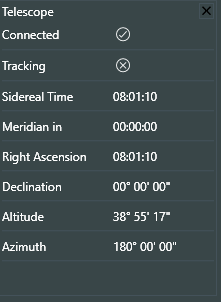

> Requires a connected [telescope](#tab-telescope) to display information

---

### Panel: Plate Solving

The Plate Solving panel allows you to start the plate solving procedure to align your mount to its actual location in the sky, making framing and finding targets way easier without utilizing star alignment.

> For Usage of the Plate Solver refer to [Usage: Plate Solving](#plate-solving)

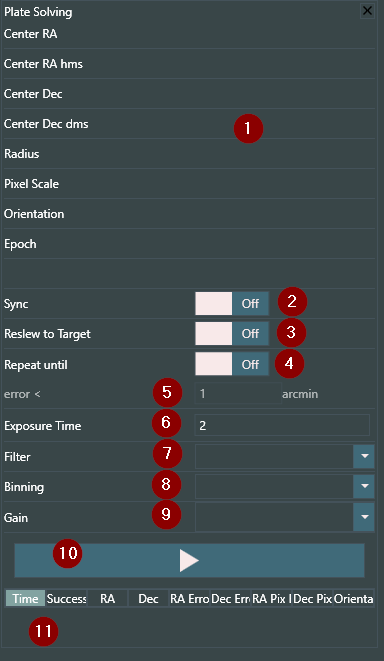

1. **Information about the latest plate solve**
    - It will display information about the location of the mount and camera rotation after one successful solve has been run
2. **Sync**
    - When enabled will sync the plate solve information to the mounts ASCOM driver
    > Should generally be enabled
3. **Reslew to Target**
    - When enabled will reslew to the target where the mount was supposed to be
4. **Repeat until**
    - When enabled will do plate solving until the error quota in (5) is met
5. **Error < # arcmin**
    - Allows you to set the maximum error after a plate solving procedure for (4)
    > Is disabled when (4) is not active
6. **Exposure Time**
    - Allows you to set the exposure time for the plate solve capture
7. **Filter**
    - Allows you to set the filter for the plate solve capture
8. **Binning**
    - Allows you to change the binning for the plate solve capture
    > Only really useful for CCD
9. **Gain**
    - Allows you to change the Gain for the plate solve capture
    > Might be unavailable depending on camera
10. **Start Plate Solve**
    - Will capture an image and try to plate solve it using the Plate Solver as defined in Settings
    > Should the plate solve fail it will ask whether to attempt the solve with the Blind Solver as defined in [Settings](#plate-solving-settings)
11. **Platesolve history**
    - Display of the last plate solves with various information

---

### Panel: Polar Alignment

The polar alignment panel gives you two ways to determine how off your polar alignment is and to improve it. One is plate solved polar alignment and the other is DARV slew.

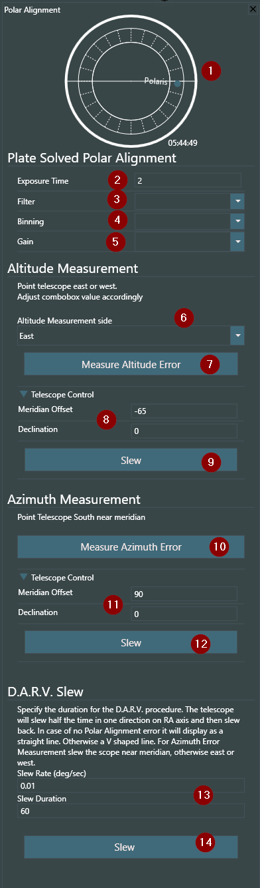

1. **Polar scope**
	- Shows position of polaris when looking through the mount's polar scope
    > Will not work for southern hemisphere. Uses latitude and longitude from settings.
2. **Exposure Time**
	- Defines the exposure time that should be used for a plate solved polar alignment measurement
3. **Filter**
	- The filter for the alignment
4. **Binning**
	- Camera binning
5. **Gain**
	- Camera gain
6. **Measurement location for altitude where the telescope is pointing at**
	- Can be either east or west	
7. **Measure Altitude Error**
	- Will start a platesolve of current position, then slews half a degree along RA axis, takes another platesolve and compares the result of both to measure the amount of error
	> Telescope should point east or west at 0 declination 
8. **Meridian Offset and Declination for telescope**
    > The values entered here will be saved as settings for using next time
9. **Slew**
	- Slews mount to specified meridian offset and declination
10. **Measure Azimuth Error**
    - Will start a platesolve of current position, then slews half a degree along RA axis, takes another platesolve and compares the result of both to measure the amount of error
    > Telescope should point south near meridian at 0 declination 
11. **Same as Step (8) except for azimuth**
	> The values entered here will be saved as settings for using next time
12. **Same as Step (9)**
13. **Duration and Rate in which the scope should move for a DARV Slew**
14. **Slew**
	- Initiates a DARV Slew by slewing half the specified Duration in one RA direction and then back while taking an exposure.

---

### Panel: Weather

Display of latest weather information from the selected weather provider in [Settings](#general-settings) if an internet connection is available.

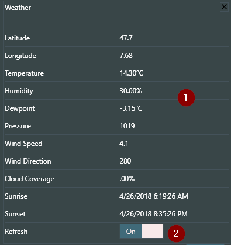

> Will only work with an internet connection

1. **Weather information**
    - Will only be displayed when refreshed (2) at least once
2. **Refresh**
    - Will toggle automatic refreshing of weather information

---

### Panel: Guider

This panel will display information as provided by [PHD2](#tab-phd2). 

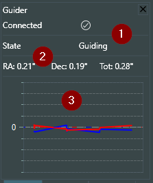

1. **Guider Status**
2. **RMS Display**
3. **Guider Graph**
    - Will utilize the scale as set in the [PHD2 tab](#tab-phd2)
    - X-Scale can be changed in the [Settings](#equipment-settings)

---

### Panel: Sequence

This panel displays the current active [sequence](#tab-sequence).


1. **Estimated finish time**
    > Will update itself automatically while the sequence runs
2. **Active Sequence Details**
3. **Start Sequence**

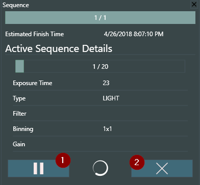

1. **Pause Sequence**
    - This will pause the sequence after the current image
2. **Cancel Sequence**
    - This will cancel the current image capture and pause the sequence
    > Will still allow you to continue the sequence later

---

### Panel: Filter Wheel

Here you can see the current selected filter, the state and are able to change the current filter.

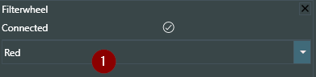

> Requires a connected [Filter Wheel](#tab-filter-wheel-and-focuser)
1. **Filter Drop Down**
    - Allows you to change the current filter in the filter wheel

---

### Panel: Focuser

This panel displays information about the focuser status and allows you to move the focuser.

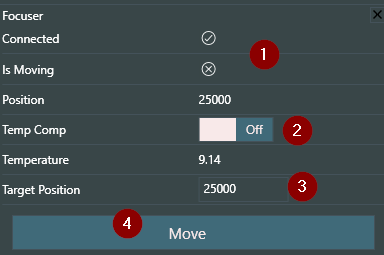

> Requires a connected [focuser](#tab-filter-wheel-and-focuser)
1. **Focuser Status**
2. **Temperature Compensation**
    - When enabled the focuser will try to compensate for ambient temperature if a temperature sensor is available
    > Will disable (3) and (4) when enabled
3. **Target Position**
    - Sets the focuser target position
4. **Move**
    - Moves the focuser to the target position (3)

---

### Panel: Imaging

The imaging panel allows you to take snapshots with your camera, for example for focussing or looking at the framing.

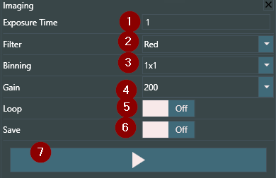

> Requires a connected [camera](#tab-camera)
1. **Exposure time**
    - You can set here the exposure time in seconds
2. **Filter**
    - You can set the filter that should be used for this snapshot
3. **Binning**
    - This allows you to change the binning
    > Only makes sense on CCD cameras
4. **Gain (not shown)**
    - Allows you to change the gain
    > Some cameras might not have the ability to change gain
5. **Loop**
    - When enabled takes subsequent snapshots until cancelled
6. **Save**
    - When enabled will save the images to the image path as defined in Settings
    > Image type will be “SNAP” for those images
7. **Enable SubSampling** *(Experimental feature)*
    - Toggles the capture of only the subsampled frame as defined in the [image panel](#panel-image)
        > Currently only supported by native Atik cameras  
        > To get the full sized frame again disable subsampling
8. **Start Snapshot**
    - Starts the snapshot
    > When loop (5) is enabled, will loop until pressed again to cancel
    
---

### Panel: HFR History

Here you can read useful information about your average HFR and the amount of stars in the image.

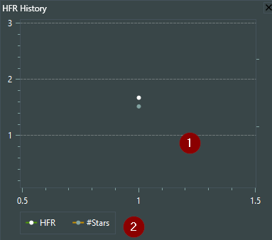

> Requires [HFR detection](#panel-image) to be enabled
1. **Display of HFR and Stars in a graph**
    - Limited to 300 entries by default
    - Right side Y axis displays the amount of stars
    - Left side Y axis displays the HFR
    > You can click on points to read out their absolute value
2. **Legend**
    > Colors will depend on the selected active color scheme

---

### Panel: Statistics

This panel shows you useful statistics about your latest captured or loaded image.

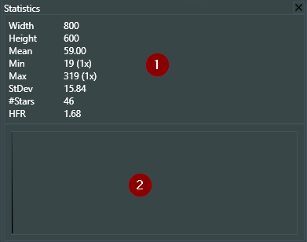

> Will display the statistics only at least one image capture
1. **Display of statistics**
    > Stars and HFR will not be calculated unless HFR detection is enabled
2. **Optimal Exposure Calculator** *(Experimental feature)*
    - Based on your camera values as defined in the [settings](#settings-equipment) will try and determine the necessary exposure time for a decently exposed image
    - Calculations will be done once an image has been captured
        > You should expose for at least 30s for this to work properly  
        > You need to set the correct values in the settings, please refer to the PixInsight script ccdparameters or sensorgen.info for your cameras' values  
        > *This is only a rough guideline and should work if you enter the correct values in the settings*  
3. **Histogram**
    - This will show your exposure histogram
    > Histogram resolution can be set in [Settings](#imaging-settings)

---

### Panel: Auto Focus

With this panel you can start the auto focus sequence if you have a motorized focuser connected.

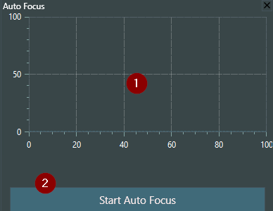

> Requires a connected [focuser](#tab-filter-wheel-and-focuser)
1. **Display of the focus steps and HFR**
2. **Start Auto Focus**
    - This will start the auto focus procedure

---

## Tab: Settings

The Settings tab is the first tab you should visit after you connect all of your equipment to set various settings that affect many aspects of NINA. You will find a lot of various settings to adjust here.

### General Settings

The General Settings tab allows you to manage NINA in terms of all general settings. Settings here affect the whole application.

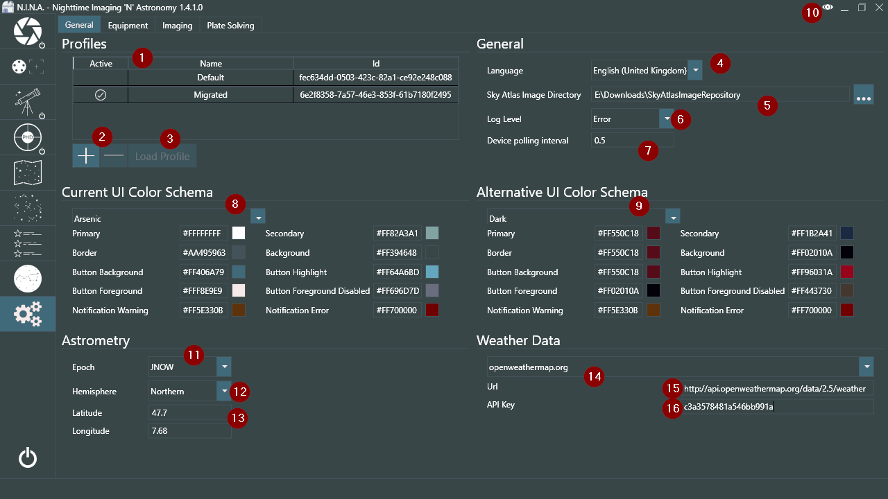

1. **Profiles**
    - A display of all profiles in NINA
    > Name of a profile can be changed by double clicking on the Name field of the profile
2. **Add or Remove Profile**
    - Those buttons allow you to add new profiles or to delete the currently selected profile
    > This action cannot be reversed, so pay attention to what you delete!
3. **Load profile**
    - Loads the currently selected profile
4. **Language Drop Down**
    - Allows you to change the language of NINA
    > Currently only English and German are available, if you want you can contribute to the translation of NINA to your language of choice, contact us on [Discord][Discord]!
5. **Sky Atlas Image Directory**
    - The directory to the [Sky Atlas][SkyAtlas] Image Repository
    - Used in [Object Browser](#tab-object-browser)
6. **Log Level**
    - You can change the log level should you encounter issues and want to report a bug
    > Please attach the log with level TRACE then
7. **Device Polling Interval**
    - Value is in seconds
    - This is the delay between polling all devices for their current information
    > Some cameras don’t cool properly when polled constantly, increasing this value to 5 is safe
8. **Current UI Color Schema**
    - Allows you to set the current UI color schema
    > You can edit the colors of the schema below it as well when set to Custom Theme
9. **Alternative UI Color Schema**
    - Allows you to set the alternative UI color schema as triggered by (0)
    > You can edit the colors of the schema below it as well when set to Custom Theme
10. **Color Schema Toggle**
    - Allows you to quickly switch between the current and alternative color schema
    > This can be done from anywhere in the application
11. **Epoch Drop Down**
    - The Epoch for your devices
        > This should be set to the epoch set on your mount
12. **Hemisphere Drop Down**
    - You can set your hemisphere here (North, South)
13. **Latitude and Longitude**
    - You can set your Latitude and Longitude here
    > Will be automatically populated when the mount connects and provides those informations  
    > You can get your latitude and longitude easily from https://www.latlong.net/
14. **Weather data Drop Down**
    - You can change the weather provider here
    > Currently only openweathermap.org is implemented
15. **Weather Url**
    - The URL to the weather provider API
16. **Weather API key**
    - Your weather API key
    - For openweathermap.org you need to register yourself to get an API key

---

### Equipment Settings

This tab allows you to change settings related to your equipment.

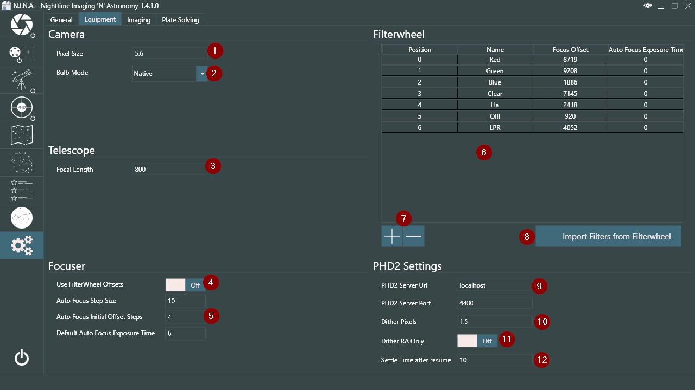

1. **Camera Pixel Size**
    - The Pixel Size of your camera sensor in micrometers
      > Will be automatically populated by the camera, if it provides the information

> For entries 2-5 refer to sensorgen.info or ccdparameters script in PixInsight

2. **Camera Read noise in e**
    - The read noise in electrons of your camera device
3. **BIAS mean (native)**
    - The mean value of your BIAS (shortest exposure) at your cameras native bit depth (4)
4. **Bit depth**
     - Your cameras native ADC bit depth
5. **Full Well Capacity in e**
    - Your cameras full well capacity in electrons
6. **Download to Data ratio**
    - The ratio the optimal exposure calculator will utilize to calculate the maximum adequately possible exposures
7. **Camera Bulb Mode**
    - Allows you to change the bulb mode of the camera
    - Native will work in most cases
    - RS232 and Mount is available as well and might be necessary for older Nikon cameras
        > For usage of RS232 and Monunt shutter refer to [Usage: Using RS232 or Mount for bulb shutter](#using-rs232-or-mount-for-bulb-shutter)
8. **Raw converter**
    - You can change the raw converter here
    - Only applies to DSLR
    - Available converters: DCRaw and FreeImage
        - DCRaw will utilize DCRaw and stretch your images to 16bit, applying the cameras specific color bias profile
        - FreeImage will deliver the frame exactly as your camera provided it and can be slightly faster for image download on slower machines
            > Note that both raw converters will deliver you the raw frame of your DSLR. but they might vary in color. Saving the raw frame without adding the camera specific profile with FreeImage can deliver more faint and less colorful raw images than you are used to.
9. **Telescope Focal Length**
    - Enter your telescope focal length here
    > This will be used for [plate solving](#panel-plate-solving)
10. **Settle time after slew**
    - After slewing NINA will wait the specified amount before starting an exposure
    - Value is in seconds
11. **Use Filter Wheel Offsets**
    - When enabled the focuser will utilize the filter wheel focus offsets as defined in (6)
12. **Auto Focus Settings**
    - Allows you to change how the focuser operates in auto focus mode
13. **Filter Wheel Filter List**
    - This filter wheel filter list is used for sequences in NINA
    > You should import your filter list from your ASCOM filter wheel at least once using (8)
14. **Add or Remove to/from Filter List**
    - Manually add or remove filters from the filter list
    > Removing always removes the selected filter
15. **Import Filters from Filter Wheel**
    > You should run this once to synchronize your filters from ASCOM to NINA
16. **PHD2 Server URL and Port**
    - You can set the PHD2 server settings here
    > Usually the defaults should work fine  
    > You need to enable PHD2 server in PHD2
17. **Dither Pixels amount**
    - The amount of pixels to dither in PHD2
18. **Dither RA Only**
    - Enables dithering in the RA axis only
19. **Settle Time after resume**
    - The time NINA should wait after a dithering process until it starts the next capture
20. **PHD2 History Size**
    - The amount of PHD2 guide values NINA will save in the History of the [PHD2 Tab](#tabs--phd2)
21. **PHD2 History Size (Imaging)**
    - The amount of PHD2 guide values NINA will save in the history of the [PHD2 Panel](#panels--guider)

---

### Imaging Settings

In the Imaging settings you can find various imaging related settings like file name patterns and display options for the imaging tab.

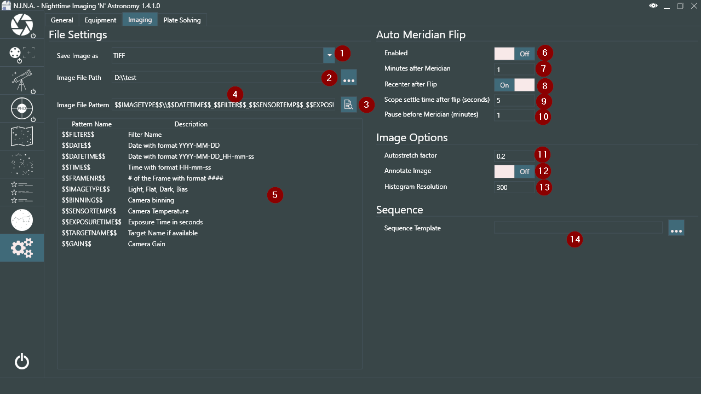

1. **Image Save Format Drop Down**
    - File format to save the image as
        - Available formats: TIFF, TIFF (zip-compressed), TIFF (lzw-compressed), XISF, FITS
    - Either format will be saved unbayered as 16bit RAW file
    - TIFF can be left as default
    > To save space you can use TIFF (Zip) or TIFF (LZW)
    > - Both algorithms are slower to save a file
    > - Compression ratio may vary and you want to test out both algorithms
2. **Image File Path**
    - The file path where you want to store the saved images
    > Please note you need to use “\\\” instead of a single “\\” for folder separation
3. **Image File Pattern Preview**
    - This button shows you a preview of the file pattern as defined in (4)
4. **Image File Pattern**
    - Here you can define the file name pattern based on the variables in (5)
    > You can also define folders and separate them with “\\\”  
    > Fixed text is also possible
5. **Image File Pattern Variables**
6. **Meridian Flip Enable**
    - This option will enable the automated meridian flip
    - The sequence will check periodically between images when to start the flip sequence
    > For usage of the automated meridian flip refer to [Usage: Automated Meridian Flip](#automated-meridian-flip)
7. **Meridian Flip start point**
    - The setting to wait until meridian is passed in minutes
    - The mount will wait until the target is # minutes after the meridian
8. **Recenter after Meridian Flip**
    - When enabled will plate solve after the meridian flip and recenter
    > Strongly suggested to enable this option  
    > Requires a set up [plate solver](#plate-solving-settings)
9. **Scope settle time after Meridian Flip**
    - The wait time until the scope is settled after a flip in seconds
    > If your mount takes a while to getting calm after a flip increase this value
10. **Pause before Meridian Flip**
    - The amount of time in minutes before the flip where the sequence will pause and wait for the meridian to pass
11. **AutoStretch factor for images**
    - Here you can define the auto stretch factor for the auto stretch in the Imaging tab
    > 0.2 or 0.3 are good values here, usually you do not need to change this  
    > This setting will affect the [plate solver](#plate-solving-settings)!
12. **Annotate images**
    - When enabled will annotate the images with HFR of the detected stars
    - Only will annotate them when [HFR detection](#panel-image) is active
    > Values are not saved into the image, it’s just for display in the Imaging tab
13. **Histogram Resolution**
    - This changes the granularity of the histogram resolution in the [statistics](#panel-statistics)
14. **Sequence Template**
    - The default sequence template for images

---

### Plate Solving Settings

This Setting tab allows you to change the plate solving mechanism. There are 3 plate solvers you can use in NINA. Selected Plate solver settings in this screenshot are for Astrometry.Net plate solver.

> For usage of the Plate Solver refer to [Usage: Plate Solving](#plate-solving)

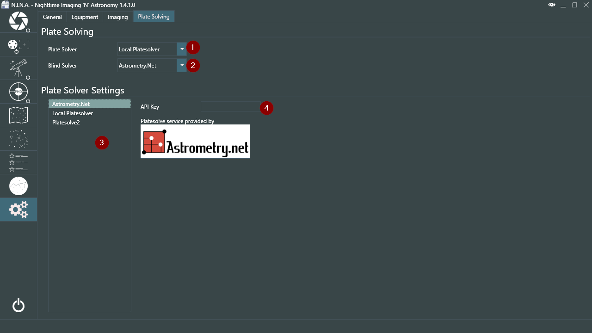

1. **Primary Plate Solver Drop Down**
    - This is the primary plate solver that is going to be used to plate solve images
    > Recommended is PlateSolve 2 or Local Platesolver
2. **Blind Solver Drop Down**
    - This is the blind solver for initial solving
    > Will be used for [Framing Assistant](#tab-framing-assistant) and for normal [plate solving](#panel-plate-solving) should the primary fail
3. **Exposure Time**
    - The default exposure time for Plate Solving
4. **Filter**
    - The default filter for Plate Solving
5. **error <**
    - The default error in arcmin for repeated Plate Solving
6. **Plate Solver Settings Selection**
    - Here you can select the various plate solvers
    > Settings for the Plate solver will appear on the right
7. **Astrometry.Net Plate Solver API Key**
    - This is the main setting for the Astrometry.Net Plate Solver
    > You need an account with astrometry.net to get an API key

Plate Solver settings for the Local Platesolver, which you can install on installation of NINA.

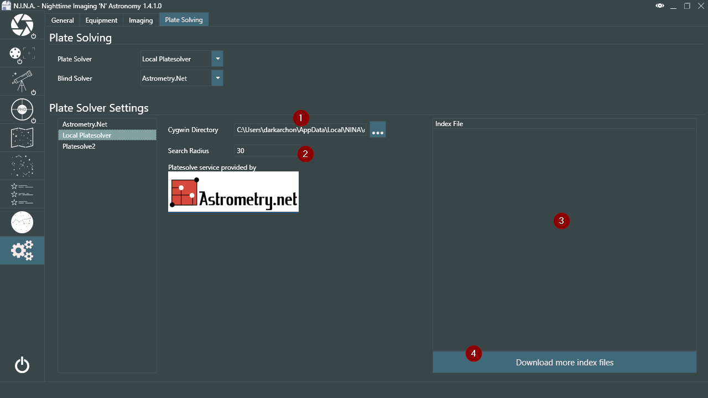

1. **Local Plate Solver Directory**
    - The directory where the local plate solver is installed
    > If you installed it manually you need to change this to where it is located  
    > If you installed it bundled with NINA you likely don’t have to change anything
2. **Local Plate Solver Search Radius**
    - This is the search radius in degrees where the local plate solver should search for matches
    > 30 degrees is usually plenty
3. **Local Plate Solver Index Files**
    - A list of all index files stored on your PC
    > They should be left at the default location where they have been downloaded to
4. **Download more index files**
    - Opens the FoV calculator and index file download window
    > You need to download index files for the local plate solver or otherwise it will not work

This window allows you download index files corresponding to your telescopes and camera field of view.

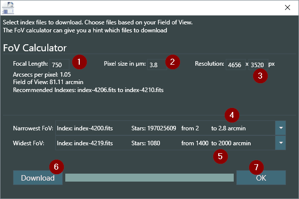

1. **Focal Length of the telescope**
    - You need to set your telescope focal length here
2. **Pixel size of the camera**
    - Here you enter the pixel size of your camera
3. **Resolution of the camera**
    - Here you set the resolution of your images
4. **Narrowest FOV selection**
    - Based on the suggestion below the camera parameters you should set the narrowest FOV index to the suggestion
5. **Widest FOV selection**
    - Based on the suggestion below the camera parameters you should set the widest FOV index to the suggestion
    > Both indexes will play a role how fast the local plate solver will run
6. **Download index files**
    - Starts the download of the index files
7. **Save and close**

Those are the settings for the PlateSolve 2 platesolver.

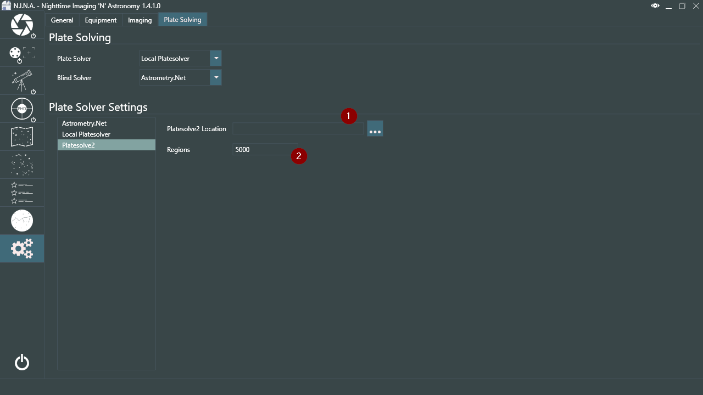

1. **PlateSolve2 Location**
    - You need to enter the path to the executable file of PlateSolve 2
    > For PlateSolve 2 to work you need to run it at least once and point it to the downloaded catalogues  
    > You need to download the catalogues from the PlateSolve 2 homepage as well
2. **PlateSolve2 Regions**
    - How many regions PlateSolve 2 needs to check for alignment before it fails
    > 1000 regions should be more than plenty depending on your initial alignment

---

# Usage

## Plate Solving

Plate solving is a great way to determine where your scope is pointing at exactly in the sky and an important aspect for fast and easy framing. Essentially what it does is taking a shot with your camera, extract the stars and tries to triangulate the current position based on an internal sky atlas of the plate solver.

> To utilize the full potential of plate solving it is required that your mount and camera are both connected to NINA.

> It is required that your camera and telescope settings in the [equipment settings](#settings-equipment) are set correctly. The two important aspects are `Camera Pixel Size` for the camera and `Focal Length` for the telescope.

NINA allows you to use the three most popular external plate solvers, each of which has its own benefits and drawbacks. Those plate solvers are Astrometry.Net, Local Astrometry and PlateSolve 2.

### General Plate Solving

To plate solve an image you need to capture an image and use the `Plate solve current image` button in the [image panel](#image-panel). This will start the procedure of plate solving your image with the Plate Solver as set in the [plate solving settings](#plate-solving-settings). Should that plate solve attempt fail the mechanism will try to use the Blind Solver to solve the image.

> Before being able to plate solve you need to configure the settings, primary solver and blind solver.

> Should it happen that both plate solving mechanisms fail please verify that your image is somewhat in focus and if necessary change the exposure time or filter for that single image.

To apply the plate solving you need to enable the options `Sync` and if you want to, `Reslew to target` in the [plate solving panel](#panel-plate-solving). The former will synchronize your mounts location to the location that the plate solver has determined you're at. The latter will reslew your mount to the location where it was supposed to be in the first place.

> This allows you to skip the whole star alignment process at your mounts start-up.

Plate Solving is also utilized in the [Automated Meridian Flip](#automated-meridian-flip) to recenter your image after a flip has been performed. This is essential for a hands-off experience of NINA.

> *Our recommendation is to set up all Plate Solvers to have a backup should one plate solver not work as expected in the field.*

### Astrometry.net Plate Solver

The Astrometry.net plate solver will utilize the internet page Astrometry.Net to plate solve an image. It requires registration on [astrometry.net](http://nova.astrometry.net) to get an API key that you need to enter in the settings.

#### Benefits
- Fast when the mounts location is unknown or far off
- Does not need to know the cameras pixel size or telescopes focal length
#### Drawbacks
- Requires an internet connection
- Slow when the mounts location is close
#### Recommendation
- Primary Solver: not recommended
- Blind Solver: recommended when an internet connection is available

### Local Astrometry Plate Solver

The local Astrometry plate solver is bundled with NINA and can be installed with the NINA setup. It requires download of index files which can be installed through NINA as well to get the required index files that you need for your combination of focal length and pixel size. See [plate solving settings](#plate-solving-settings).

#### Benefits
- Adequately fast when the mounts location is unknown or far off
- Fast when the mounts location is close
- Does not need an internet connection to work
#### Drawbacks
- Download of the correct index files is crucial for the plate solving performance
- Can pick up hot pixels as stars (especially an issue with DSLR)
#### Recommendation
- Primary Solver: recommended with the right index files
- Blind Solver: recommended

### PlateSolve 2

PlateSolve 2 is a standalone executable which can be downloaded from the [PlateSolve 2 home page](http://planewave.com/downloads/software/). It requires the download of at least one catalogue of stars so it can properly work. You need to start the executable once standalone and set the catalog location of the catalog that you want to use. Both the APM or UCAC3 catalogues will work just fine, but it is recommended to download both of them should you encounter issues with any one of them.

#### Benefits
- Very fast when the mounts location is close to the target
- Does not need an internet connection to work
#### Drawbacks
- Slow when the mounts location is far off and the focal length of the scope is long
#### Recommendation
- Primary Solver: recommended
- Blind Solver: not recommended (not possible)

---

## Using the Object Browser

With the [object browser](#tab-object-browser) you can easily determine targets to shoot for the evening. It seamlessly connects into the [framing assistant](#tab-framing-assistant) and the [sequence](#tab-sequence).

> To being able to utilize the object browser you need to configure your current location in the Astrometry settings in the [general settings](#general-settings). That includes Epoch, Hemisphere, Latitude and Longitude. *Otherwise the object browser will show you wrong data!*

> You also might want to consider to download the [SkyAtlas][SkyAtlas] and configure the location of it in the [general settings](#general-settings) so that the object browser shows you previews of the objects in question.

The idea of the object browser is to show you targets that are relevant to you for this evening. You can set various filters for the object type or maximum altitude. Should you have not decided yet what you want to shoot following filters are suggested to use:
- Object Type: set it to whatever you would like to photograph
- Apparent size: important to get your framing right and make sure that you can actually fit the object into the frame and/or have enough resolution for the object in question
- Minimum altitude: Generally you don't want to shoot anything that is below 45 degrees at its peak due to atmospheric disturbance

The Moon Phase in the Object Browser will tell you the current phase of the moon, when it will rise and set so you don't have to guess or rely on the internet.

> The object browser heavily depends on your imaging location, you will need to experiment with various filters to see their effects.

### Object Display

All objects that are in the object browser are displayed the same way. Once you understand how to read the display it becomes very easy and tremendeously helpful for you to determine whether the target is worth shooting for you.

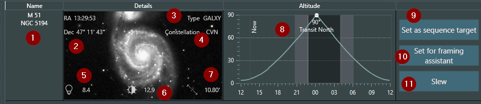

1. The name of the object in question with any available alternatives. Spoken names like "Whirlpool Galaxy" are not implemented yet.
2. The Coordinates of the object in RA and Dec, should you want to save the coordinates or slew manually to them
3. The object type which is GALXY (Galaxy) in this case. Those types are abbreviations to save space. In the filter it will use the full description instead of the abbreviation.
4. The objects constellation
5. Apparent magnitude of the object, if available. Determines the peak brightness.
6. Surface brightness of the object, if available (if not, it's 99.9). The actual full brightness of the object.
7. Apparent size of the object, if available. Shows you the apparent size in arcminutes or degrees, depending on size.
8. The altitude of the object, current time and darkness meter.
    - This one is a bit more complex to explain; the line with a specific peak is the actual altitude of the object at any given time, generally: the higher, the better. Transit north or south tells you whether the object will pass to your south or north.
    - The Now line shows you your current time so you can crossreference the current altitude of the object.
    - The darker lines are show you the start of the nautical and astro dark.
9. Sets the object as the target for the sequence, see [Usage: Advanced sequencing](#advanced-sequencing)
10. Sets the object as the target for the framing assistant, see [Usage: Framing with the Framing Assistant](#framing-with-the-framing-assistant)
11. Slews to the target in question so you can frame and align manually or with plate solving, see [Usage: Plate Solving](#plate-solving)


---

## Dithering with PHD2

Dithering is an important part of the imaging process. The benefit of dithering will be a clearer image with less pattern noise and more detail since the image will be shifted by a few pixels with a dithering request.

NINA supports dithering out of the box utilizing PHD2 and makes it easy to set up and have it running. There are a few prerequisites to be able to dither your images during a sequence.

- A mount needs to be connected
- PHD2 needs to be be running, guiding and also connected to NINA
  - The PHD2 settings in the [Equipment Settings](#settings-equipment) need to be set up
- Dithering needs to be enabled in the sequence

### PHD2 Settings

You need to enable the Option "Enable Server" in PHD2 so NINA can connect to PHD2 to get the current guiding and RMS data as well as send dithering commands.

> The setting to enable it is in PHD2 under ```Tools -> Enable Server```

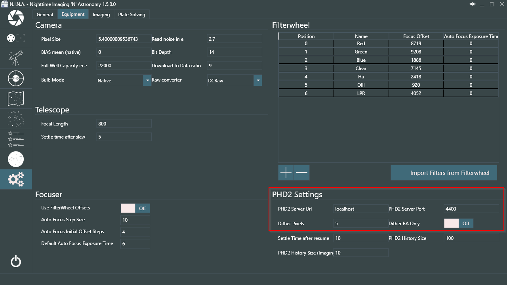

The settings for NINA in the [Equipment Settings](#settings-equipment) can be left at their defaults. The PHD2 Server Port of `4400` is correct and so is the the server URL of `localhost` since we assume PHD2 is running on the local computer.

> If you use a different computer to guide you need to change the server URL to the IP or Hostname of the guiding server.

The other two important settings are `Dither Pixels` and `Dither RA only`. You can leave the Dither Pixels to 5 or reduce it if you shoot at a high focal length. The default works fine for most focal lengths. It depends on the guide camera and focal length of the guidescope as well.

> You can calculate how much arcseconds a single pixel of your camera is by calculating the FOV of your guide scope with guide camera and getting the arcseconds per pixel values. A calculator for this is for example the [Astronomy Tools Field of View Calculator](https://astronomy.tools/calculators/field_of_view/).

Dithering RA only should be disabled in general so PHD2 will dither in all directions instead of only RA. If you have a high backlash and it takes a long time for the dither to settle, you can disable this option. This is generally not recommended.

### Sequence Settings

Once you have set up your PHD2 you will need to connect it first in the [PHD2 Tab](#tab-phd2). Once connected and verified that it sends data you can enable Dithering in the [Sequence tab](#tab-sequence).

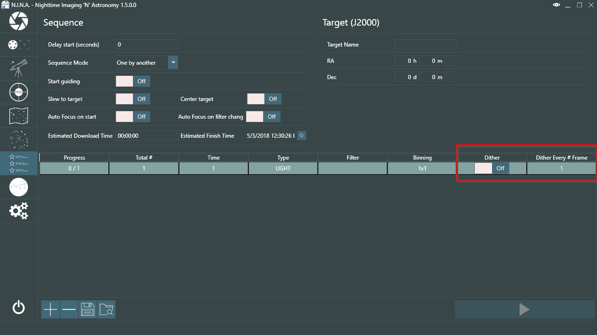

In the sequence tab you have two settings that affect dithering. The first and obvious is `Dither` for any given sequence entry. If you enable `Dither` PHD2 will start dithering every frame. You might want to consider dithering less than every frame or dither only for specific sequence entries. For example, if you use a LRGB rotational sequence (see: [Advanced Sequencing](#advanced-sequencing)) you might only want to dither on every L frame. If you use a OSC Camera it is suggested to dither every frame.

> The dithering will happen while the camera downloads the image, so depending on how long your download is and how long it takes the guiding to settle you might not even lose time.

Once enabled in the sequence, the sequence is running and PHD2 is connected the dithering will happen automatically. You don't need to enable anything else.

---

## Framing with the Framing Assistant

---

## Automated Meridian Flip

Automated Meridian flips are important once your mount passes the meridian while imaging. They prevent that your telescope and camera bump into the mount and do major damage to your equipment. NINA has built-in functionality for the automated flip, even if your mount does not support it in firmware.

> Prerequisite for this functionality is that your mount is connected to NINA and the setting for flipping is enabled.

To enable the Automated Meridian Flip you need to enable it in the imaging settings.

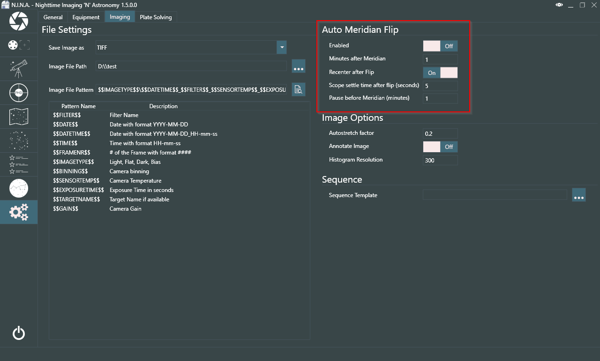

There are a few settings that you can change here that will affect what the meridian flip will do. 

Minutes after meridian is when the flip actually will happen. 1 Minute as the default is a good time for the mount to actually notice it's past the meridian and flip automatically.

Recenter after flip will use plate solving to determine where your mount is and recenter it after the flip.

Scope settle time after flip will wait for the specified time after the flip and center.

Pause before meridian is when the mount will stop imaging and wait for the time to pass until minutes after meridian.

The whole Sequence of the Automated Meridian Flip works like this:

1. Camera shoots and downloads an image
2. Check if next image time + time to meridian is less than pause before meridian
   1. If there is still time go to 1.
   2. Otherwise continue with 3.
3. Show the Meridian Flip UI
4. Stop guiding in PHD2 and mount tracking
5. Wait until meridian passes + minutes after meridian setting
6. Give a slew command to the same RA/Dec coordinates where it was before so the mount flips
7. Start mount tracking
8. Wait for Scope settle time
9. If Recenter after flip is disabled go to 10.
   1. Otherwise take a snap shot and plate solve it
   2. Recenter according to the plate solve to the correct mount location
10. Auto Select star in PHD2 and resume guiding
11. Wait for guiding to settle
12. Continue with 1.

> Please note that some steps might fail or your mount can entangle itself during the automated meridian flip. **Always supervise your mount and NINA while flipping to ensure that there are no issues.**

---

## Advanced Sequencing

---

## Using RS232 or Mount for Bulb Shutter

If you have a DSLR that does not allow BULB exposure time over USB this is a solution for you. Instead of native USB mode you can use a selfmade RS232-Shutter cable or use the mounts port for shutter (if available). You can test whether you need or don't need an external shutter cable by trying taking an exposure of more than 30s. This will trigger bulb mode on DSLR. If your camera won't take a picture you need to look at this section.

> Prerequsite for any method of this functionality is that your DSLR has a shutter port!

You can find the necessary settings in the [Equipment Settings](#settings-equipment).

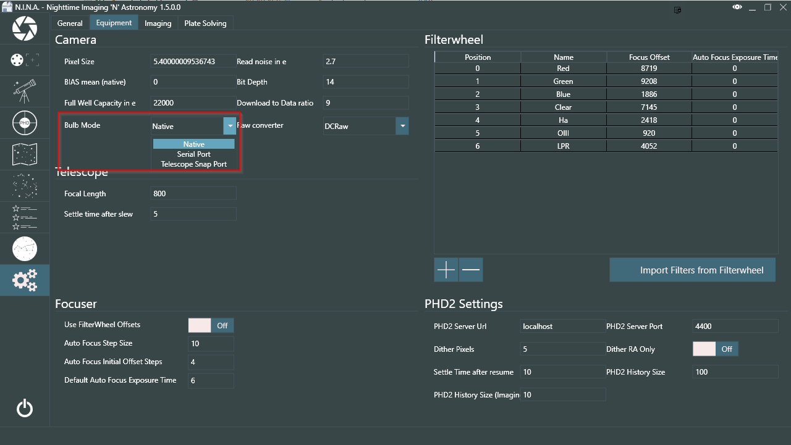

If your mount has a SNAP port we advise to test out the [Mount for Bulb Shutter](#mount-for-bulb-shutter) functionality before the RS232 for Bulb Shutter.

### RS232 for Bulb Shutter

One way to trigger the shutter mechanism of your DSLR is utilizing a self-made RS232 to Bulb shutter cable. There are already some pre-made cables to be bought online for this issue or you can DIY.

> DSUSB cables are not supported since they don't expose a COM Port!

You can find some tutorials on how to build a DIY shutter cable here:

- [Nikon MC-DC2](https://www.cloudynights.com/topic/457536-usb-corded-shutter-control-for-nikon/)
- [Canon #1](http://www.beskeen.com/projects/dslr_serial/dslr_serial.shtml)
- [Canon #2](http://www.covingtoninnovations.com/dslr/CanonRelease.html)

Once you have a RS232-Shutter cable built you need to connect it to the PC, install drivers for your RS232 adapter and check for the COM port used.

In NINA you need to select `Serial Port` for the Bulb Mode and change the COM port to the port your RS232 is using.

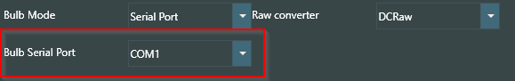

After that you can try and snap an image with an exposure time of longer than 30s. If it works you are done and can now expose for any time that you wish.

Should you face issues with the RS232-Shutter exposure in NINA feel free to contact us on our [Discord][Discord].

> Please not we have no experience with DIY of shutter cables!

### Mount for Bulb Shutter

If you are lucky enough that your mount runs with EQMOD and has a shutter port you can use that to trigger the bulb shutter mechanism.

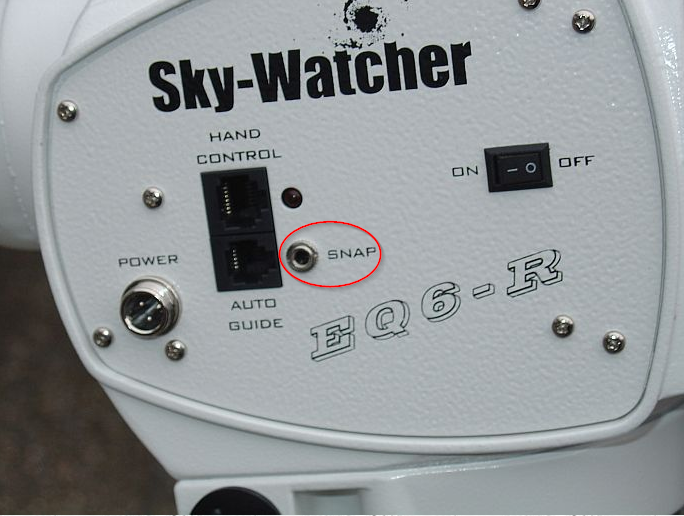

To try use that select the `Telescope Snap Port` from the settings drop down.

> Currently confirmed and tested mounts for Mount Bulb Shutter are the SkyWatcher EQ6-R and AZ-EQ-6-GT.

First you need to connect a shutter cable from the SNAP port of your mount to your DSLR. For that you will likely need a 3.5mm jack to your cameras specific shutter port cable. 

Once everything is physically connected you need to connect the mount to NINA and the Camera as well.

> If your mount has two SNAP ports you can use either. Both will work depending on the next setting.

The next step is to experiment with the command setting that is sent to the mount. 

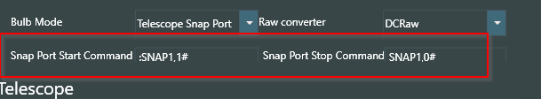

The default settings might already work for you already, so feel free to try and take a snap shot that is longer than 30s in NINA. If the shutter is triggered, you are done and can take longer exposures than 30s now.

Should this not work please try the commands `:SNAP2,1#` to start and `:SNAP2,0#` to stop the snap port. 

Should your bulb exposure still not trigger please contact us on our [Discord][Discord].

---


# Troubleshooting

## Errors

---

## Bugs

Should you encounter any bugs during your usage of NINA please report them to the [Issues Tracker][IssuesTracker] or directly to us on our [Discord][Discord]. If possible attach the latest Log file from the day on which you encountered the issue.

Log files can be found in ```%LOCALAPPDATA%\NINA\Logs\```

---

## Comments and Suggestions

We are always happy to take new comments and suggestions to improve your and our experience with NINA. As with Bugs feel free to drop them by us on our [Issues Tracker][Issues Tracker] or [Discord][Discord]. You are always welcome and your voice will be heard - or you get your money back.